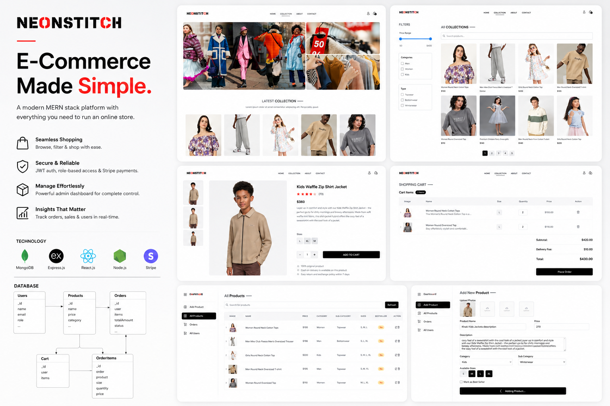

# NeonStich

**NeonStich** is a modern and stylish clothing e-commerce web app built with the MERN stack (MongoDB, Express.js, React.js, Node.js). It delivers a seamless shopping experience for customers and a powerful admin dashboard for managing the entire store.

## 📸 Project Preview

## 🌐 Live Demonstration

⚠️ **Important:** The backend is hosted on Render's free tier. If data does not load immediately, please allow up to 5 minutes for the server to wake up and then refresh the page.

🔗 **Live Application:** https://neonstich.netlify.app/

🔗 **Live Admin panel:** https://neonstich-admin-panel.netlify.app/

## ✨ Features

- 🛍️ **Product Browsing** – View items by category, size, and price.
- 🧾 **Cart & Checkout** – Add items with selected sizes, manage cart, and pay securely.
- 🔐 **Authentication & Roles** – Secure login/register for users and admins with protected routes.
- 💳 **Stripe Payments** – Integrated Stripe for secure, real-time payments.
- 📦 **Order Tracking** – Customers can view order history; admins can update statuses.
- 🔎 **Search & Filters** – Filter by category, size, price range, and search by keyword.
- 🧵 **Mobile-Responsive** – Fully responsive across all devices.

## 🛠 Tech Stack

- **Frontend:** React.js, Redux Toolkit, Tailwind CSS, React Router
- **Backend:** Node.js, Express.js
- **Database:** MongoDB
- **Authentication:** JWT
- **File Uploads:** Cloudinary
- **Payments:** Stripe

---

## 🔧 Admin Features

- 📋 **Product Management** – Add, edit, delete products with images and details.
- 👥 **User Management** – View all users, update roles, or delete accounts.
- 📦 **Order Management** – View all orders, update status (e.g., Processing → Shipped).
- 📊 **Dashboard Overview** – Track total sales, number of products, users, and orders.
- 🔐 **Role-Based Access** – Only authenticated admins can access dashboard & admin routes.
